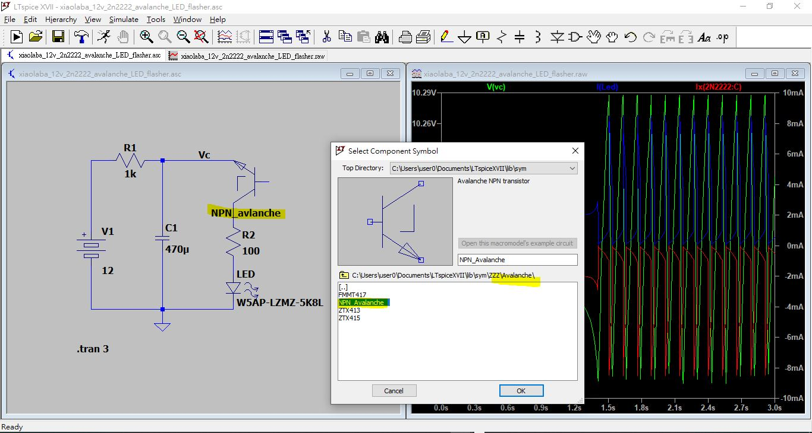

# xiaolaba_12v_2n2222_avalanche_LED_flasher
special LTspice bjt model, capable to do Avalanche of NPN bipolar transistor,  
mine of uses LTspice XVII = LTspice X + V + II, X=10, V=5 II=2  17  
https://www.analog.com/cn/lp/002/tools/ltspice-simulator-tw.html  


downlaod, http://bordodynov.ltwiki.org/lib.zip (Additional library for LTspice, file is lib.zip ~20M)  
upzip, goto lib\  
make cp.bat as following,  
run the bat, copy lib and ZZZ folder,  
```
copy lib\sub\Avalanche.Lib %USERPROFILE%\Documents\LTspiceXVII\lib\sub\
copy lib\sym\ZZZ\*.* %USERPROFILE%\Documents\LTspiceXVII\lib\sym\ZZZ\
pause
```

restart LTspiceXVII
add component [ZZZ\]


job done
  


LTspice source code  
```
Version 4
SHEET 1 880 680
WIRE -240 -64 -288 -64
WIRE -128 -64 -160 -64
WIRE -32 -64 -128 -64
WIRE 32 -64 -32 -64
WIRE 112 -16 96 -16
WIRE -128 80 -128 -64
WIRE 32 80 32 32
WIRE -288 96 -288 -64
WIRE 32 192 32 160
WIRE -288 272 -288 176
WIRE -128 272 -128 144
WIRE -128 272 -288 272
WIRE 32 272 32 256
WIRE 32 272 -128 272
WIRE -128 304 -128 272
FLAG -128 304 0
FLAG -32 -64 Vc
SYMBOL cap -144 80 R0
SYMATTR InstName C1
SYMATTR Value 470?SYMBOL LED 16 192 R0
SYMATTR InstName LED
SYMATTR Value W5AP-LZMZ-5K8L
SYMBOL Misc\\battery -288 80 R0
SYMATTR InstName V1
SYMATTR Value 12
SYMBOL res -144 -80 R90
WINDOW 0 0 56 VBottom 2
WINDOW 3 32 56 VTop 2
SYMATTR InstName R1
SYMATTR Value 1k
SYMBOL res 16 64 R0
SYMATTR InstName R2
SYMATTR Value 100
SYMBOL ZZZ\\Avalanche\\NPN_Avalanche 64 -16 R180
SYMATTR InstName NPN_avlanche
TEXT -320 360 Left 2 !.tran 3


```


ref:
http://www.crystalradio.cn/forum.php?mod=viewthread&tid=2162178&extra=page%3D2&page=2  
http://bordodynov.ltwiki.org/  

```
For LTspiceIV users, you must copy the contents of the lib and example folder to the LTspiceIV lib and example folder.

For LTspiceXVII users, you need to copy the contents of my collection LTspiceXVII folder to the LTspiceXVII similar name folder.

To find the desired folder (There are two such folders), start typing any item  (click on the symbol of the logical element in the menu). In the top line

You will see "(the required address)\LTspiceXVII\lib\sym.

  Are you aware that the user directory of LTspiceXVII is in "Documents" of the user.

 C:\Users\uswrname\Documents\LTspiceXVII\lib

 For example:
 C:\Users\Joe\Documents\LTspiceXVII\lib\sym  

and C:\Users\Joe\Documents\LTspiceXVII\lib\sym\ZZZ is where keep my symbols

 C:\Users\Joe\Documents\LTspiceXVII\lib\sub   is where i keep my .subckts and lib

```
